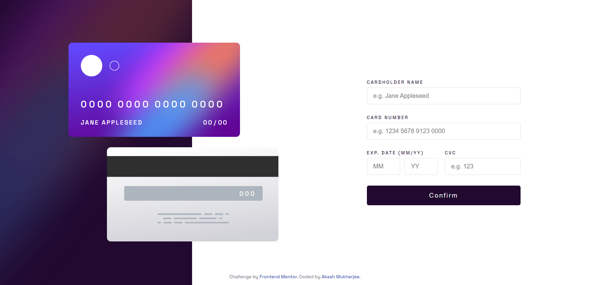

# Frontend Mentor - Interactive card details form solution

This is a solution to the [Interactive card details form challenge on Frontend Mentor](https://www.frontendmentor.io/challenges/interactive-card-details-form-XpS8cKZDWw). Frontend Mentor challenges help you improve your coding skills by building realistic projects. 

## Table of contents

- [Frontend Mentor - Interactive card details form solution](#frontend-mentor---interactive-card-details-form-solution)
  - [Table of contents](#table-of-contents)
  - [Overview](#overview)
    - [The challenge](#the-challenge)
    - [Screenshot](#screenshot)
    - [Links](#links)
  - [My process](#my-process)
    - [Built with](#built-with)
  - [Author](#author)

## Overview

### The challenge

Users should be able to:

- Fill in the form and see the card details update in real-time
- Receive error messages when the form is submitted if:
  - Any input field is empty
  - The card number, expiry date, or CVC fields are in the wrong format
- View the optimal layout depending on their device's screen size
- See hover, active, and focus states for interactive elements on the page

### Screenshot

### Links

- Solution URL: [Github](https://github.com/memukherjee/frontendmentor_projects/tree/main/interactive-card-details-form-main)
- Live Site URL: [LIVE](https://memukherjee.github.io/frontendmentor_projects/interactive-card-details-form-main)

## My process

### Built with

- Semantic HTML5 markup
- CSS custom properties
- Flexbox
- Vanilla JS
- Form validation
- Regular Expressions
- Event Listeners
- DOM Manipulation

## Author

- Website - [Akash Mukherjee](https://memukherjee.netlify.app)
- Frontend Mentor - [@memukherjee](https://www.frontendmentor.io/profile/memukherjee)
- LinkedIn - [Akash Mukherjee](https://www.linkedin.com/in/memukherjee)