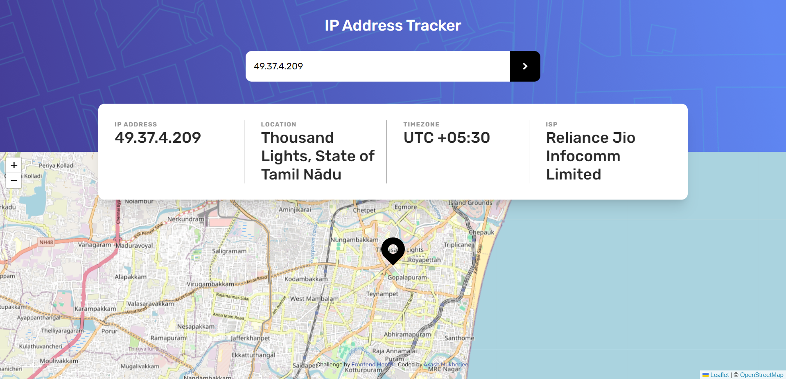

# Frontend Mentor - IP address tracker solution

This is a solution to the [IP address tracker challenge on Frontend Mentor](https://www.frontendmentor.io/challenges/ip-address-tracker-I8-0yYAH0). Frontend Mentor challenges help you improve your coding skills by building realistic projects. 

## Table of contents

- [Frontend Mentor - IP address tracker solution](#frontend-mentor---ip-address-tracker-solution)
  - [Table of contents](#table-of-contents)
  - [Overview](#overview)
    - [The challenge](#the-challenge)
    - [Screenshot](#screenshot)
    - [Links](#links)
  - [My process](#my-process)
    - [Built with](#built-with)
  - [Author](#author)

## Overview

### The challenge

Users should be able to:

- View the optimal layout for each page depending on their device's screen size
- See hover states for all interactive elements on the page
- See their own IP address on the map on the initial page load
- Search for any IP addresses or domains and see the key information and location

### Screenshot

### Links

- Solution URL: [Github](https://github.com/memukherjee/frontendmentor_projects/tree/main/ip-address-tracker-master)
- Live Site URL: [LIVE](https://me-ip-address-tracker.netlify.app/)

## My process

### Built with

- Semantic HTML5 markup
- CSS custom properties
- Flexbox
- Tailwind CSS
- [IP Geolocation API by IPify](https://geo.ipify.org/)
- [LeafletJS](https://leafletjs.com/) maps API
- [OpenStreetMap](https://www.openstreetmap.org/) maps API

## Author

- Website - [Akash Mukherjee](https://memukherjee.netlify.app)
- Frontend Mentor - [@memukherjee](https://www.frontendmentor.io/profile/memukherjee)
- LinkedIn - [Akash Mukherjee](https://www.linkedin.com/in/memukherjee)